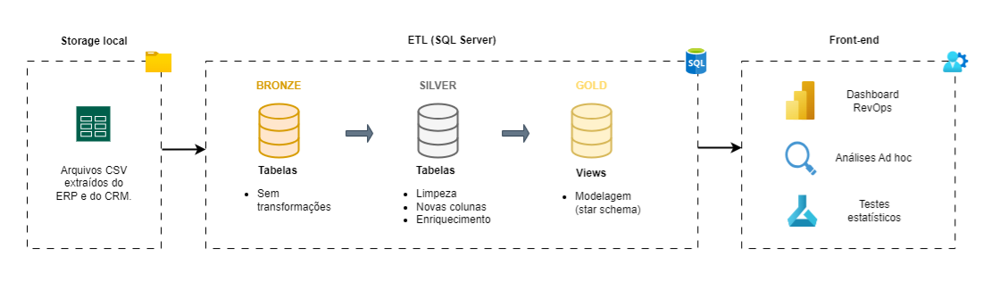

# Projeto: Data Analytics #

Bem-vindo ao repositório deste projeto! 

Este projeto apresenta uma solução completa de análise de dados, desde a construção de um data warehouse simples até a criação de um dashboard para monitoramento do negócio. Além disso, inclui testes estatísticos e recomendações baseadas nos insights obtidos.



### Informações importantes: 

Origem do projeto: Esta é uma releitura de um trabalho que desenvolvi em uma experiência profissional anterior. Para preservar a privacidade da empresa, dados como nomes de clientes, produtos, preços e custos foram substituídos por valores fictícios. No entanto, a estrutura do projeto foi mantida para garantir a fidelidade ao cenário real.


## ◾ Contexto de Negócio

- Havia a necessidade de organizar os dados e definir métricas e KPIs de vendas e marketing para acompanhar o desempenho da área comercial. Para isso, seria essencial criar um dashboard que oferecesse tanto uma visão consolidada quanto uma análise mais detalhada. O   
  objetivo era permitir uma visualização rápida e prática de indicadores como Receita, Lucro, ROAS, Share dos clientes, qualidade do funil de vendas, taxa de conversão, Renda Mensal Recorrente (MRR) e Lifetime Value (LTV).
  
- Durante a análise dos dados, percebeu-se que as vendas de embalagens para panetone aumentavam no final do ano, algo esperado. No entanto, ao investir em marketing, esse crescimento não era significativamente maior. Para entender melhor essa relação, decidi realizar um   teste estatístico e avaliar se os investimentos em campanhas de marketing, entre outubro e dezembro, realmente impactavam as vendas nesse período.
  
- Optei pelo teste t (inserir justificativa para a escolha do teste) e, com os resultados, apresentei recomendações embasadas, reforçando a tomada de decisão orientada por dados. Isso permitiu direcionar os próximos passos com mais confiança e estratégia.


## ◾ Visão Geral

Para o projeto serão seguidas as seguintes etapas:  

###   Arquitetura de Dados  
Implementação de um Data Warehouse simples seguindo o padrão Medallion Architecture:  
- **Bronze**: Carregamento dos dados no formato original (*as-is*).  
- **Silver**: Limpeza, padronização e enriquecimento dos dados.  
- **Gold**: Modelagem e preparação dos dados para consumo final (views).  

###   ETL (Extração, Transformação e Carga)   
Processamento e organização dos dados para que estejam prontos para análises e visualizações.  

###   Modelagem de Dados   
Criação das tabelas fato e dimensão, garantindo uma estrutura otimizada para consultas e análises.  

###   Dashboard no Power BI  
Desenvolvimento de um painel interativo com métricas e KPIs estratégicos, como Faturamento, Lucro, Margem, ROAS e outros indicadores de performance de vendas e marketing.  

###   Análise de Dados  
Aplicação de testes estatísticos para avaliar o impacto de investimentos em anúncios de campanhas de marketing.  

###   Apresentação de Resultados
Interpretação dos testes estatísticos e recomendações baseadas nos insights obtidos, auxiliando na tomada de decisão.


## ◾ Tecnologia 

- **`SQL Server`**: T-SQL e SQL.
- **`Power BI`**: DAX, Power Query, Power BI Service.
- **`Azure ML`**: Python (Statsmodels, SciPy, Pandas).


## ◾ Resultados

[Dashboard Power BI](https://www.loom.com/share/31660dc2d6f44b78a92252a9df3f1c47?sid=2fac780b-5ea6-4f70-8637-9c41cb62ea46)


## ◾ Diretórios do Repositório
```
projeto-data-warehouse-analytics/
│
├── 📂 datasets                          # Arquivos brutos usados no projeto
│    ├── ads.csv                         # Arquivo com os anúncios em campanhas de marketing
│    ├── leads.csv                       # Arquivo com informações sobre leads coletadas do CRM e sistemas de marketing
│    ├── vendas.csv                      # Arquivo com as vendas realizadas, coletadas do ERP
|
├── 📂 docs                              # Documentação do projeto
│    ├── arquitetura_final.drawio        # Arquivo Draw.io com a representação da arquitetura do projeto e fluxo de dados
│    ├── data_catalog.md                 # Catálogo dos datasets, com descrições dos campos e metadados
│    ├── diagrama .drawio                # Diagrama da modelagem de dados (star schema)
│
├── 📂 scripts                           # Scripts SQL scripts usados nas etapas de ETL
│    ├── 📂gold                          # Scripts de modelagem
|    ├── 📂silver                        # Scripts de criação, carregamento, limpeza e transformação
|    ├── create_database.sql             # Script de criação da base de dados e schemas
|
├── LICENSE                              # Licença utilizada no repositório
├── README.md                            # Visão geral do projeto e demais informações

```


## ◾ Licença

Projeto sob licença [MIT License](LICENSE).
 
---
## ◾ Sobre Mim

Meu nome é **Leonardo Mundim**, sou um curioso Analista de Dados & BI, focado em resolver problemas reais de negócios com soluções data-driven, mesclando o pensamento analítico e simplicidade.

[](https://linkedin.com/in/leonardo-mundim)


